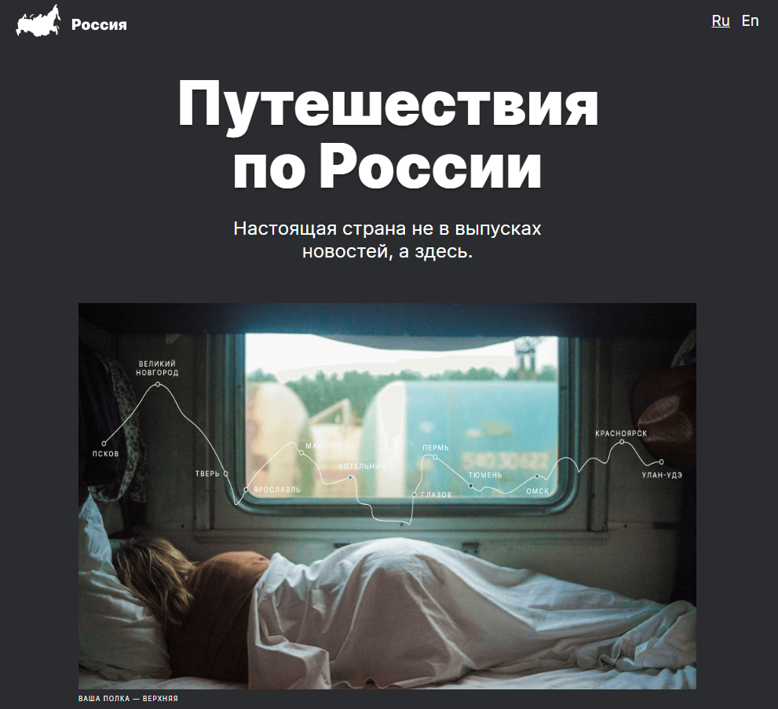

<h1 align="center">"Путешествие по России"</h1>
<h3 align="center">Вторая проектная работа</h3>

## Описание проекта

Учебный проект от [Я.Практикум](https://practicum.yandex.ru/web/) предтставляет собой одностраничный веб-сайт с адаптивным дизайном о туризме по России.

Проект позволяет отработать основные навыки, например:
+ работа с адаптивной вёрсткой;
+ построение структуры проекта по методологии БЭМ;
+ навык разбивать проект на секции и блоки ориентируясь на макет Figma;
+ приминение Grid элементов для построения галлерей;
+ использовать наложение элементов;

## Используемые технологии

HTML5 | CSS3 | БЭМ / файловая структура в соответствии с Nested БЭМ | адаптивная верстка | Grid Layout | Flexbox

## [Ссылка на макет Figma](https://www.figma.com/file/P6znKyAUDwnyYdajUX0wWt/Sprint-3_-Russia-_-desktop-%2B-mobile-(Copy)?node-id=62863%3A870&t=jdwZoIBpnmHelvsO-0)

## [Ссылка на сайт](https://elislis7.github.io/russian-travel/)

**План по доработке проекта**

 - Реализация функционала смены языка страницы
 - Английская версия сайта

<h4 align="center">План по доработке проекта</h4>

- Доработка сайта по расширенному [макету](https://www.figma.com/file/hzVjdK04BSlLyQL6Jv6jCD/Russia-%2F-desktop-%2B-mobile-(Copy)-(Copy)?type=design&node-id=0-1&mode=design&t=dzCjQIbYzKHbVGdr-0) |
- Доработка функционала сайта посредством JavaScript:
  - Добавить popup для просмотра изображений полностью | ;
  - Добавить закрытие popup на кнопку и оверлей | ;
  - Сделать функциональным переключение языка страницы | ;